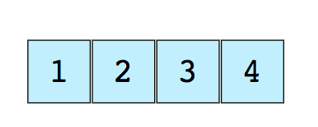

# Структуры данных

Структура данных - это контейнер, информация в котором скомпонована определенным образом. Благодаря той или иной компоновке данных, структура данных будет эффективна в одних операциях и неэффективна - в других.

Не важно, какую именно задачу вы решаете, так или иначе вам придется иметь дело с данными, будь то зарплата сотрудника, биржевые котировки, список продуктов для похода в магазин или обычный телефонный справочник.

В зависимости от конкретного сценария, данные нужно хранить в тех или иных структурах.

## Массивы

Массив - это упорядоченный набор данных, имеющих одинаковый тип и объединенных под одним именем. Доступ к отдельному элементу массива осуществляется через его индекс. Все массивы состоят из смежных ячеек памяти. Младший адрес принадлежит первому элементу массива, старший - последнему. Массивы могут быть одномерными и многомерными.

Массив - это простейшая и наиболее распространенная структура данных. Другие структуры данных, например, стеки и очереди, производны от массивов.

Каждому элементу массива ставится в соответствие положительное целое число, которое называется **индексом элемента**, которое соответствует положению этого элемента в массиве. В большинстве языков программирования элементы в массиве нумеруются с 0.

Далее показан простой массив размером 4, содержащий элементы (1,2,3,4)

<p align="center">
  
</p>

Массивы позволяют хранить некоторое количество элементов однотипной информации в удобной форме. Массив - некоторая совокупность значений одного и того же типа, например, 10 значений типа char или 15 значений типа int, которые хранятся в памяти в виде непрерывной последовательности.

Массив имеет свое собственное имя (идентификатор), доступ к его отдельным **элементам** осуществляется с помощью целочисленного цикла.

Например, объявление

```c
float debts[20];
```

означает, что `debts` является массивом, состоящим из 20 элементов, каждый из которых может содержать в себе значение типа `float`. Первый элемент массива получает имя `debts[0]`, второй элемент `debts[1]` и так далее, вплоть до `debts[19]`. Каждому элементу данного массива может быть присвоено значение типа `float`. Например

```c
debts[5] = 32.54;
debts[6] = 1.2e+21;
```

По сути дела, вы можете использовать тот или иной элемент массива так же, как и вы использовали бы переменную того же типа. Например, вы можете читать значение в конкретный элемент массива

```c
scanf("%f", &debts[4]); // читать значение в пятый элемент массива
```

Важно понимать, что в языке С массива как отдельного элемента нет. Элементы массива доступный **каждый в отдельности**, тогда как к самому массиву как единому целому обратиться невозможно. В примере выше, имя `debts` обозначает не сам массив как таковой, а **адрес его первого элемента**. Одним из самых заметных следствий недоступности массива как единого объекта является невозможность присваивания массивов.

Единственный случай обращения к массиву как к целому существует при использовании оператора `sizeof`. В этом случае мы можем узнать длину массива, разделив "размер массива" на "размер его элемента"

```c
int arr[15] = {0};
printf("%d\n",(int) sizeof(arr) / sizeof(int));
```

### Инициализация массивов

При описании массива язык C позволяет задать начальное значение его элементов. Массив при этом изображается в виде перечисления в фигурных скобках, а сами элементы разделяются запятыми.

```c
int y[] = {1, 2, 23, 5, 6, 7};
```

Обратите внимание, что при использовании инициализатора, мы не указываем размер массива, компилятор вычислит ее сам. Все элементы инициализатора обязаны быть константами времени компиляции, то есть среди перечисленных через запятую элементов не должно быть ни переменных, ни вызовов функций, ни таких выражений, которые компилятор не сможет вычислить прямо во время компиляции.

### Одномерные массивы

Синтаксис объявления массива выглядит следующим образом

```
тип имя[размер];
```

Например

```c
double total[50];
```

Нумерация элементов массива начинается с нуля. Получить доступ к элементам можно следующим образом:

```c
total[0] = 50.99; // присвоить первому элементу значение 50.99
total[1] = 88.11;
...
total[49] = 77.56; 
```

Одномерный массив представляет собой список переменных, имеющих одинаковый тип и хранящихся в смежных ячейках памяти в порядке возрастания их индексов.

Объем памяти, необходимый для хранения массива, зависит от его типа и размера. Размер одномерного массива в байтах вычисляется по формуле:

```
размер = sizeof(базовый_тип) * количество элементов
```

В языке C не предусмотрена проверка выхода индекса массива за пределы допустимого диапазона. Иными словами, по время выполнения программы можно по ошибке выйти за пределы памяти, отведенной для массива, и записать данные в соседние ячейки, в которых могут храниться другие переменные и даже программный код. Ответственность за предотвращение подобных ошибок лежит на программисте.

Имя массива указывает на его первый элемент.

### Многомерные массивы

Язык C поддерживает многомерные массивы. На практике наиболее часто используются двухмерные массивы, которые представляют собой массив одномерных массивов. Синтаксис объявления многомерного массива выглядит так:

```
тип имя[размер1],[размер2],...,[размер_N]
```

В случае с двухмерным массивом размеров будет два. Двухмерный массив хранится в виде матрицы, в которой первый индекс задает номер строки, а второй - номер столбца. Таким образом, при обходе элементов в порядке их размещения в памяти, правый индекс изменяется быстрее, чем левый. Объявим массив, состоящий из 100 строк и 200 столбцов

```c
int c[100][200];
```

Обратиться к элементу массива можно так:

```c
c[1][5];
```

### Перебор элементов массива

Для перебора элементов массива удобно использовать цикл for. В первом параметре переменной-счетчику присваивается значение 0 (элементы массива нумеруются с нуля), условием продолжения является значение переменной-счетчика меньше количества элементов массива. В третьем параметре указывается приращение на единицу на каждой итерации цикла Внутри цикла доступ к элементу осуществляется с помощью квадратных скобок, внутри которых указывается переменная-счетчик.


## Работа со строками

**Строки** (или говоря шире, **данные в текстовом представлении**) часто имеют непредсказуемый размер: в большинстве случаев во время написания программы мы можем лишь приблизительно прикинуть, какого количества памяти "уж точно хватит" для размещения строки. Память обычно выделяется с некоторым запасом, а во время исполнения оказывается, что строка занимает меньше памяти, чем под нее выделено; как следствие, при обработке строк необходимо соглашение, позволяющее указать, какова в настоящий момент длина строки.

В языке C строки представляются массивами символов, то есть массивами элементов типа `char`, при этом **корректной строкой** считается только такой массив типа `char`, в котором хотя бы один элемент равен нулю; он рассматривается как **ограничитель**, то есть все элементы, предшествующие нулевому, считаются составляющими строку, а всё, что находится в массиве после нулевого элемента, игнорируется.

Преимуществом такого подхода является то, что в языке C отсутствует ограничение на длину строк: при необходимости можно обрабатывать строки длиной хоть в миллион символов или больше (всё зависит от оперативной памяти). Недостатком является то, что для определения длины строки ее приходится просматривать всю в поисках нулевого элемента. Длина строки будет разницей между положением ограничителя (нулевого элемента) и начала строки.

Очень часто для представления строк используется массив, если быть предельно точным, то одномерный массив символов. В языке C предусмотрен только один вид строк - строки, завершающиеся нулевым байтом, их также называют C-строками. Такие строки представляют собой массив символов, последним элементом которых является нулевой байт.

Массив символов объявляется

```c
char first_name[21];
```

Объявляя массив символов помните, что последняя его ячейка должна быть зарезервирована для нулевого символа. Поэтому, если реально у вас должно храниться 20 символов, то добавьте еще один - для нулевого символа.

Второй способ объявления строки выглядит так:

```c
char s[] = "Это строка";
```

Справа от знака присваивания записана строковая константа. В конце строки добавляется ноль `\0`.

### Работа со строкой как с массивом символов

Рассмотрим пример программы, которая удаляет из заданной строки все символы, кроме цифр:

```c
#include <stdio.h>
#include <stdlib.h>

int main(void) {

	char line[101];
	int i,j;
	gets(line);
	
	for (i = 0;line[i] != '\0';i++) {
	
		while (!((line[i] >='0' && line[i]<='9') || (line[i] == '\0'))) {
			for (j = i; line[j] !='\0';j++) {
				line[j] = line[j+1];
			}
			line[j] = '\0';
		}
	}

	printf("%s",line);
}
```

Рассмотрим код для вычисления длины массива

```c
int main(void) {

	char s[] = "tekst";
	int len = 0;

	for (int i = 0;s[i] != '\0';i++) {
		len++;
	}

	printf("Длина строки: %d",len);
}
```